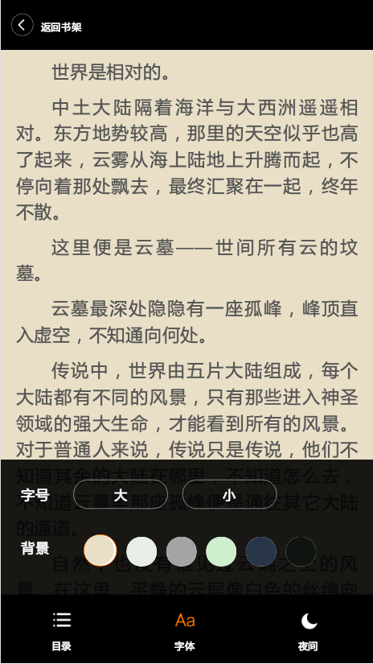
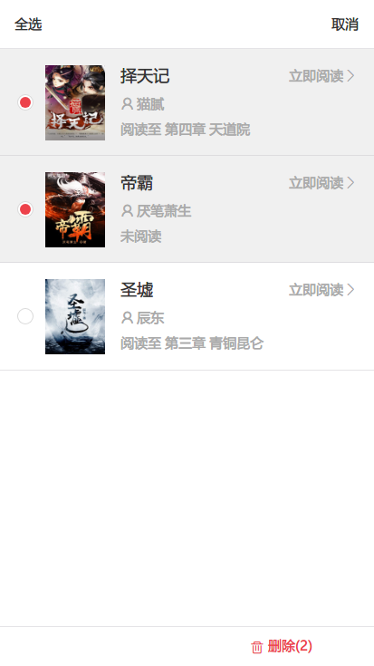

# 基于react + express + nodejs爬虫的移动书城（vue版本修改而来）

> 技术栈：react + react-router + redux + webpack + fetch + scss + flex + express + nodejs + mysql + localStorage

> [预览地址](http://tgxhx.xyz/book)

> [api地址](https://github.com/tgxhx/node-book-api)

> [爬虫地址](https://github.com/tgxhx/node-crawler)

## 使用说明

``` bash
#克隆项目
git clone git@github.com:tgxhx/react-reader.git

# 安装依赖
npm install

# 本地开发环境 访问http://localhost:3000
npm start

# 构建生产
npm run build

```

## 项目说明
关于爬虫和api就不详细说明了，完全跟vue版本的一样，[查看地址](https://github.com/tgxhx/vue-reader)

在写这个之前对于vue算是比较熟练了，转到react，jsx的语法研究了两天，然后研究了一下redux，发现跟vuex是类似的东西，上手起来也比较快。

然后开始用react全家桶重写这个项目，利用空余时间前后花了大概不到一个星期的样子，再之后花了一两天新增了vue版本没有的书架功能。

项目是基于create-react-app构建的，增加了sass的支持，组件热重载还未支持，加入了react-router和redux。

总结一下，vue和react的理念我认为是差不多的，重点都是组件化，state、props也是类似的作用，vuex和redux也有一定程度的类似，二者区别可能就是语法不一样了，vue写起来更像传统的html、js、css开发方式，jsx的写法有的人可能难以接受，但是也不难掌握，另外可能react对于js的掌握程度要求更高一些。

所以我认为，vue和react如果你熟悉其中之一，我相信上手另一个是很快的，因为核心理念你已经掌握了，剩下了就是语法了，vuex和redux也是一样。

本项目难点我认为是书架功能，也都写了注释，有类似想法的可以相互印证。

## 功能
- [x] 首页推荐
- [x] 书籍详情
- [x] 相似推荐
- [x] 分类查看
- [x] 阅读器
- [x] 章节跳转
- [x] 更改字体
- [x] 更换主题
- [x] 夜间模式
- [x] 翻页浏览
- [x] 本地存储（存储每本书的阅读进度）
- [x] 书架

## 项目截图


